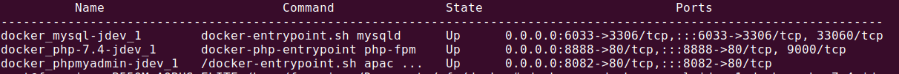

# docker-ambiente-dev
Receita para montagem do ambiente em docker com PHP 7.4, Mysql, NGINX, phpMyAdmin e XDEBUG

Este repositório tem como objetivo padronizar o ambiente de desenvolvimento do CETT referente aos projetos Joomla.
Nos fornece uma certa facilidade que por meio de alguns comandos como segue abaixo, o ambiente ser montado com todos os padrões e agilidade possível.

**I M P O R T A N T E**
- Não recomendo criar um clone deste repositorio, porque você ira criar um clone do projeto dentro da pasta html, e pode surgir conflitos ao tentar comitar os projetos.
- Crie os arquivos individualmente seguindo os modelos aqui dispiveis.

**PASSOS**
1) Escolha o melhor diretorio que você ira montar seu ambiente, e crie o arquivo **docker-compose.yml** igual o aqui disponibilizado;
2) Crie um diretorio chamado **environment** e dentro dele o diretorio **php7.4**, e por fim crie o arquivo **Dockerfile** conforme disponibilizado;
3) Crie um diretorio chamado **db** que será utilizado como volume do banco de dados que iremos importar para desenvolvimento;
4) Crie um diretorio chamado **log** e dentro dentro outro diretorio chamado **nginx**. Este será responsável por armazenar os logs de erros do servidor web;
5) Crie um diretório chamado **html** que será utilizado como volume para o codigo fonte do projeto que será desenvolvido.

**INFORMAÇÕES IMPORTANTES**
- Utilizando o terminal, acesse o diretorio que você criou os arquivos, e execute os seguintes comandos para preparar o ambiente
- No mesmo nível do arquivo docker-compose.yml digite:  
  $ **docker-compose build** 
  Este comando tem como função verificar se os arquivo criados estão corretos, e preparar as imagens; 
  
  $ **docker-compose up -d** 
  Este comando vai subir as imagens, disponibilizando para uso 
  
  $ **docker-compose ps -a** 
  Execute este este comando para verificar se as imagens estão montadas e seu status 
  
  Exemplo:
  
  
  
